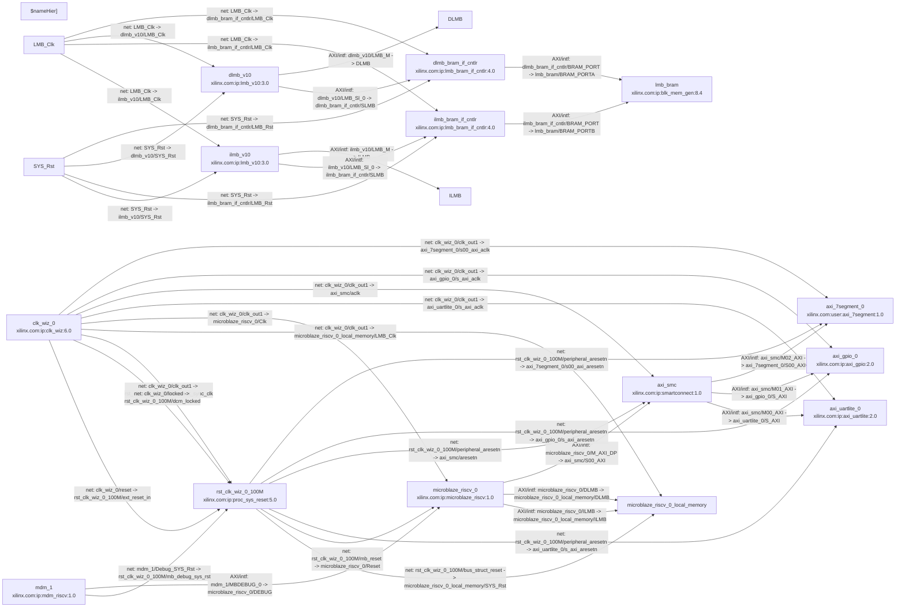

# thesi2s

<!-- BD_MERMAID_INDEX_START -->

## Vivado Block Designs (auto-generated)

Generated Mermaid files:

- `docs/bd/design_mysoc.tcl.mmd`

Preview (first diagram):

<!-- BD_MERMAID_INDEX_END -->