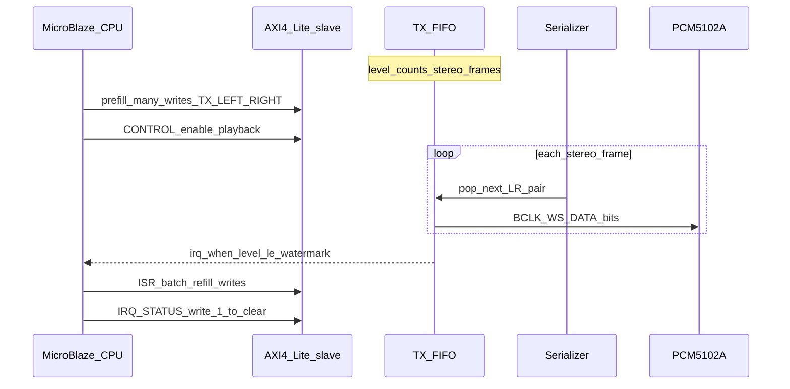
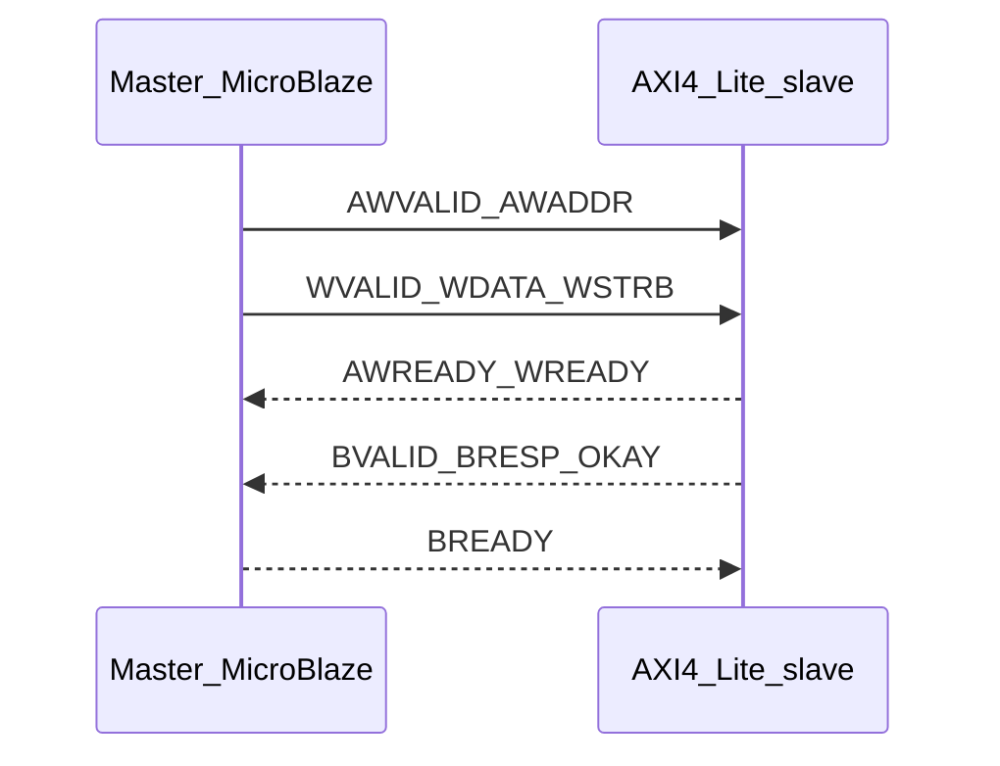

# Sumber bacaan: kuasai I2S, AXI, FPGA, audio, dan integrasi (in & out)

Daftar ini disusun untuk skripsi **I2S TX + AXI4-Lite + MicroBlaze/Vitis + PCM5102A**. Urutan: mulai dari **gratis/resmi**, lalu buku teks.

## Spesifikasi dan dokumen resmi (gratis)

| Topik | Sumber |
|--------|--------|
| **I2S / bus audio** | NXP *I2S bus specification* (warisan Philips) — cari PDF resmi NXP dengan kata kunci `I2S bus specification`. |
| **I2C** (latar saja) | NXP **UM10204** — *I2C-bus specification and user manual*. |
| **AMBA AXI4 / AXI4-Lite** | ARM **AMBA AXI and ACE Protocol Specification** (bagian AXI4-Lite). |
| **PCM5102A** | Texas Instruments **PCM5102A datasheet** + **application notes** (format data, clock, filter). |
| **7-Series clock** | Xilinx **UG472** (*7 Series FPGAs Clocking Resources User Guide*), **UG953** (Clocking Wizard). |
| **MicroBlaze V / SoC** | Xilinx **Embedded Design Hub** — dokumentasi MicroBlaze V, AXI, interrupt; **Vitis** embedded flow. |
| **ILA** | Xilinx *Vivado Design Suite User Guide: Programming and Debugging* (Integrated Logic Analyzer). |

## Buku teks digital design & FPGA

| Judul (ringkas) | Penulis | Mengapa |
|-----------------|---------|---------|
| *Digital Design and Computer Architecture: ARM Edition* | Harris & Harris | RTL, FSM, memori, dasar SoC; cocok fondasi. |
| *FPGA Prototyping by Verilog Examples* | Chu | Pola RTL praktis Xilinx, cocok mahasiswa. |
| *Advanced FPGA Design* | Steve Kilts | Timing, clock, optimasi (baca selektif). |

## Audio DSP (sampling, format, pipeline)

| Judul (ringkas) | Penulis | Mengapa |
|-----------------|---------|---------|
| *Discrete-Time Signal Processing* | Oppenheim & Schafer | Teori sampling, spektrum, filter (bab awal cukup). |
| *Understanding Digital Signal Processing* | Richard Lyons | Penjelasan intuitif PCM dan proses real-time. |

## Linux / driver (jika lanjut ke ASoC)

| Sumber | Catatan |
|--------|---------|
| Kernel **ASoC** (`sound/soc/`) | Baca driver I2S sederhana + *device tree bindings* di `Documentation/devicetree/bindings/sound/`. |
| *Linux Device Drivers* (O'Reilly / online) | Konsep char device, interrupt, mmap — **bukan** fokus skripsi bare-metal tetapi fondasi lanjut. |

## Praktik di proyek kamu (repo lokal)

- [PANDUAN-I2S-DAN-INTEGRASI-LENGKAP.md](chapter-2/PANDUAN-I2S-DAN-INTEGRASI-LENGKAP.md) — alur UART vs I2S, DAC, angka \(F_s\).
- [OUTLINE-BAB-I-V-I2S-AXI.md](OUTLINE-BAB-I-V-I2S-AXI.md) — struktur bab + nama file gambar.
- Repo FPGA (`sbml`): `I2S_SLAVE_LITE_MASTER_GUIDE.md`, `I2S_V2_IMPLEMENTATION_SPEC.md`, `I2S_AXI_REGISTER_DOC.md`.

## Cara belajar efektif

1. Baca **datasheet PCM5102A** + satu **spesifikasi I2S** — samakan dengan gelombang di osiloskop/ILA.  
2. Baca bab **AXI4-Lite handshake** + satu contoh transaksi di simulasi.  
3. Implementasi kecil: **toggle register → ILA**; lalu **BCLK/WS**; terakhir **FIFO + IRQ**.  
4. Tulis **tabel actual vs target** setiap kali mengubah MMCM atau pembagi.

---

## Protokol I2S dan visualisasi alur data (in and out)

Bagian ini merangkum **apa yang lewat di mana**: dari file/sampel di CPU sampai bit di kabel, tanpa mencampur UART sebagai “jalur audio”.

### Tiga sinyal serial (plus MCLK opsional)

| Sinyal | Nama lain | Peran singkat |
|--------|-----------|----------------|
| **BCLK** / SCK | bit clock | Satu tick = satu **bit** pada jalur DATA dalam slot saluran. |
| **WS** / LRCK | word select, LR clock | Memilih **kiri vs kanan**; frekuensi WS = **frekuensi sampling** \(F_s\) (satu period WS = satu frame stereo). |
| **DATA** / SD / DIN | serial data | Aliran bit PCM, MSB dulu, sesuai format Philips I2S. |
| **MCLK** | master clock | Opsional; banyak modul DAC/codec memakainya; PCM5102A sering fleksibel—ikuti datasheet + PCB modul. |

**Frame stereo (format umum: 32 bit × 2 saluran):** satu frame = **64** perioda BCLK.  
Hubungan: \(f_{\mathrm{BCLK}} = 64 \times F_s\), \(f_{\mathrm{WS}} = F_s\).

### Philips I2S: urutan bit dalam satu slot 32 bit (konsep)

Untuk **satu saluran** (mis. kiri), dalam 32 tick BCLK:

1. **Bit 0** setelah tepi WS: sering **padding** (delay 1 bit Philips).
2. **Bit 1 … N**: **N** bit sampel (16 atau 24), **MSB dulu**.
3. **Sisa slot**: biasanya **nol**.

Saluran **kanan** mengulangi pola yang sama saat WS berganti.

*In:* sampel integer bertanda per saluran.  
*Out:* satu bit per edge BCLK pada DATA, dengan WS yang menandai saluran.

### Diagram: alur end-to-end (software → kabel → DAC)

```mermaid
flowchart LR
  subgraph hostIn["Sumber data"]
    wav[WAV_or_generator]
    conv[float_to_int_if_needed]
  end
  subgraph cpuDomain["CPU_AXI_clock"]
    vitis[Vitis_C]
    axiW[AXI_write_registers]
    fifoIn[TX_FIFO_push]
  end
  subgraph audioDomain["audio_clk"]
    fifoOut[TX_FIFO_pop]
    ser[I2S_serializer]
    pins[BCLK_WS_DATA]
  end
  subgraph analogOut["Board"]
    dac[PCM5102A]
    out[Line_out_speaker]
  end
  wav --> conv
  conv --> vitis
  vitis --> axiW
  axiW --> fifoIn
  fifoIn --> fifoOut
  fifoOut --> ser
  ser --> pins
  pins --> dac
  dac --> out
```

**Kunci paham:** AXI menulis **kata-kata register** (lambat, burst tidak untuk Lite); I2S mengeluarkan **bit tiap BCLK** (kontinyu). FIFO **mengabsorpsi** perbedaan kecepatan itu.

### Diagram: refill FIFO + watermark IRQ

### Diagram: satu transaksi AXI4-Lite write (register)

Read channel: `AR*` → `R*` dengan pola VALID/READY serupa.

### Apa yang harus kamu “lihat” di ILA / osiloskop

1. **64 BCLK** per satu naik/turun penuh WS (atau setengah period WS tergantung definisi gambar—yang penting konsisten dengan serializer kamu).  
2. **DATA** berubah pada posisi bit yang sesuai fungsi `i2s_next_serial_bit` (atau setara).  
3. Saat **FIFO** rendah: **irq** naik, CPU menulis batch, level naik lagi.

### Gambar untuk skripsi (impor ke `contents/figures/`)

| File (disarankan) | Isi visual |
|---------------------|------------|
| `diagram-aliran-audio-datapath.pdf` | Versi “tinggi” alur host → AXI → FIFO → I2S → DAC (sudah direferensikan di Bab II). |
| `diagram-sinyal-i2s-philips.pdf` | Satu frame: BCLK, WS, DATA dengan anotasi bit 0…31 per saluran. |
| `flowchart-fifo-refill-isr.pdf` | ISR + watermark + W1C status. |

Buat di **Draw.io / Visio / PowerPoint** → export PDF/PNG dengan nama persis seperti di LaTeX.

---

*Daftar dapat diperluas dengan rujukan paper dari Bab II setelah sitasi formal ditetapkan.*
