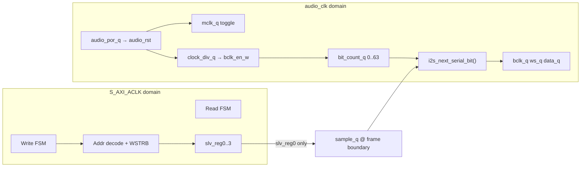

# Master guide: `i2s_slave_lite_v1_0_S00_AXI.v` (current RTL + flow to v2)

This file is the **AXI4-Lite slave + I²S TX serializer** for your custom IP. The top wrapper is `i2s.v`, which only instantiates this module and wires ports.

---

## 1) What this module does today (v1 snapshot)

| Aspect | Current behavior |
|--------|------------------|
| Bus | AXI4-Lite slave, 32-bit data |
| Address width param | `C_S_AXI_ADDR_WIDTH = 4` (only low bits used) |
| Register file | 4 × 32-bit: `slv_reg0` … `slv_reg3` |
| Audio path | **TX only**: `i2s_mclk`, `i2s_bclk`, `i2s_ws`, `i2s_data` |
| Sample source | **`slv_reg0`** is latched into `sample_q` each stereo frame |
| `slv_reg1` | **`[7:0]` packed control** (2-FF sync from AXI): **PLAY**, **MUTE**, **FS_SLOW**; gates / mutes serialized data and optionally halves BCLK rate |
| `slv_reg2..3` | Writable/readable **scratch** — not used by I²S logic |
| IRQ | **None** |
| FIFO | **None** |
| Sample format | **16-bit per channel** packed in 32-bit word: `[31:16]=L`, `[15:0]=R` |
| Clock domains | **Two**: `S_AXI_ACLK` (registers) and `audio_clk` (I²S timing) |

**Wrapper note:** `i2s.v` has an `audio_rst` port, but `i2s_slave_lite_v1_0_S00_AXI` does **not** take it; reset for the audio domain is **internal POR** only (`audio_por_q`). If you need deterministic reset from PS/PL, wire that in v2.

---

## 2) Block diagram (mental model)



CDC: `slv_reg0` is sampled into `sample_q` on `audio_clk` when `bit_count_q == 0`. That is a **single stable 32-bit** crossing; for v2 FIFO you must use explicit CDC (gray pointers, or async FIFO) if AXI and audio rates differ.

---

## 3) AXI4-Lite: handshake you must understand

### Write channel

- Master drives `AWADDR`, `AWVALID`, `WDATA`, `WSTRB`, `WVALID`.
- Slave asserts `AWREADY`/`WREADY` when it can accept.
- Slave asserts `BVALID` with `BRESP` when write completes.

Relevant code: write FSM `state_write` **L132–L196**, register update **L207–L257**.

### Read channel

- Master drives `ARADDR`, `ARVALID`.
- Slave asserts `ARREADY`, then `RVALID` + `RDATA`.

Relevant code: read FSM **L259–L305**, `S_AXI_RDATA` mux **L307**.

---

## 4) Address decode (how offsets map to `slv_regN`)

Constants:

- `ADDR_LSB = (C_S_AXI_DATA_WIDTH/32) + 1` → for 32-bit bus, **`ADDR_LSB = 2`** (byte address bits `[1:0]` ignored → word index).
- `OPT_MEM_ADDR_BITS = 1` → index width **2 bits** → **4 registers**.

Register index (word select):

```text
index = AWADDR[ADDR_LSB + OPT_MEM_ADDR_BITS : ADDR_LSB]
      = AWADDR[3:2]   // when ADDR_LSB=2, OPT_MEM_ADDR_BITS=1
```

So with **byte addresses** on the bus:

| Byte offset | `AWADDR[3:2]` | Register |
|-------------|---------------|----------|
| `0x00` | `2'b00` | `slv_reg0` |
| `0x04` | `2'b01` | `slv_reg1` |
| `0x08` | `2'b10` | `slv_reg2` |
| `0x0C` | `2'b11` | `slv_reg3` |

`WSTRB[3:0]` enables per-byte writes inside the 32-bit word.

---

## 5) Register map **as implemented today** (truth from RTL)

| Offset | RTL name | R/W | Used by I²S? | Meaning today |
|--------|----------|-----|----------------|----------------|
| `0x00` | `slv_reg0` | RW | **Yes** | Stereo packed sample: `[31:16]=L`, `[15:0]=R` (16-bit each). Latched into `sample_q` at start of each 64-BCLK frame. |
| `0x04` | `slv_reg1` | RW | **Yes (ctrl)** | Packed control in `[7:0]` (see §1). Resets to `1` (**PLAY**). |
| `0x08` | `slv_reg2` | RW | No | Scratch |
| `0x0C` | `slv_reg3` | RW | No | Scratch |

There is **no** separate `ID`/`STATUS`/FIFO/IRQ block yet — optional **v2** spec; this core stays **4 words** with **packed `CTRL` at `0x04`**.

---

## 6) I²S output path (clock + serializer)

All of **L309–L432** runs on **`audio_clk`**, not `S_AXI_ACLK`.

### 6.1 Internal audio reset (`audio_rst`)

**L352–L355:** shift register `audio_por_q` holds reset high for a few `audio_clk` cycles after power-up. This is **not** the same as `S_AXI_ARESETN`.

### 6.2 MCLK (`mclk_q`)

**L364–L374:** on each `audio_clk` posedge, `mclk_q` toggles.

So:

```text
f_mclk = f_audio_clk / 2
```

### 6.3 BCLK enable (`bclk_en_w`)

**L362–L376:** `clock_div_q` counts `0..3` on each `audio_clk` edge; `bclk_en_w` is true when `clock_div_q == 0`.

So **one BCLK “step”** (half-period advance in the state machine) occurs every **4** `audio_clk` cycles.

The I²S FSM toggles `bclk_q` once per enabled step → **full BCLK period = 8 `audio_clk` cycles** in the steady state.

So:

```text
f_bclk = f_audio_clk / 8
```

### 6.4 Frame and sample rate

- `bit_count_q` runs **0..63** on BCLK edges (via `bclk_en_w` gating) → **64 BCLK per stereo frame** (Philips-style 32 BCLK per channel slot).
- `ws_q = bit_count_q[5]` → toggles each 32 BCLK → **WS frequency = f_bclk / 64**.

Combine:

```text
Fs = f_bclk / 64 = f_audio_clk / (8 * 64) = f_audio_clk / 512
```

Examples:

- If `f_audio_clk = 24.576 MHz` exactly → `Fs = 48 kHz` exactly.
- If `f_audio_clk = 24.56897 MHz` (MMCM actual) → `Fs ≈ 47.9863 kHz` (your “≈48k” mode in the planning doc).

**There is no `/4` path in this RTL file** — only the `/8` BCLK relative to `audio_clk` as analyzed above. Your **Mode1 ≈96k** needs a **different divider** (or different `audio_clk`), i.e. v2 `i2s_clkgen`.

### 6.5 Where the sample is taken

**L415–L418:** when `bit_count_q == 0` at the rising-half of BCLK generation, `sample_q <= slv_reg0`.

So **one new stereo frame** starts every 64 BCLK; software must update `slv_reg0` fast enough or you repeat/hear glitches — this is why your v2 plan adds **FIFO + IRQ**.

### 6.6 Serializer function `i2s_next_serial_bit`

**L329–L347:** for each 32-BCLK channel slot:

- `pos == 0` → output **0** (I²S 1-bit delay after WS edge)
- `pos` 1..16 → output **16 data bits** MSB first from `samp[31:16]` (left) or `samp[15:0]` (right)
- else → **0** padding

So today it is **16-bit effective** per channel inside a 32-bit slot.

**v2 change:** extend to **24 bits** in positions 1..24 and pad the rest (per your planning section 5.2).

---

## 7) End-to-end software flow (v1)

1. CPU (MicroBlaze) writes packed stereo sample to **`0x00`** (`slv_reg0`).
2. On next frame boundary, audio logic copies `slv_reg0` → `sample_q`.
3. Serializer shifts bits to `i2s_data` synchronized with `i2s_bclk` / `i2s_ws`.

There is **no** “push stereo frame on second write” yet — that is your v2 `TX_LEFT` / `TX_RIGHT` rule.

---

## 8) Map your **planning doc** → this file (what changes where)

Use this as a file-level checklist when you implement v2:

| Plan section | Where it lives today | v2 action |
|--------------|----------------------|-----------|
| Wider addr + 16 regs | `OPT_MEM_ADDR_BITS`, case/mux | Expand decode; add regs `ID`, `CONTROL`, … |
| FS_MODE div4/div8 | Fixed `/8` implicit in `clock_div_q` + toggle pattern | Replace with parameterized clkgen or second enable path |
| TX FIFO | None | New `tx_fifo` block; pop at frame boundary |
| TX_LEFT / TX_RIGHT | Only `slv_reg0` | Split writes; push on RIGHT |
| IRQ + watermark | None | New `irq_unit` + output port to INTC |
| 24-bit I2S | `i2s_next_serial_bit` 16-bit | Change `pos` range and bit indexing |
| `audio_rst` from BD | Not used in slave | Connect or remove; avoid two competing resets |

---

## 9) “Done” checklist tied to **this** RTL file

You fully understand `i2s_slave_lite_v1_0_S00_AXI.v` when you can answer without looking:

1. Which clock domain owns `slv_reg0` vs `sample_q`?
2. What is the exact formula `Fs(f_audio_clk)` for the current divider?
3. On which condition is `slv_reg0` sampled into the audio domain?
4. How many BCLK per frame, and how is `ws_q` derived?
5. Which bits of the packed word are actually sent on the wire for left vs right?
6. Why playback glitches if CPU cannot keep up (and what v2 fixes that)?

---

## 10) Related docs in this repo

- `D:\Vivado-projects\Basys3\sbml\I2S_AXI_REGISTER_DOC.md` — documents **current** reg usage from software side.
- `D:\Vivado-projects\Basys3\sbml\I2S_V2_IMPLEMENTATION_SPEC.md` — frozen **v2** target (FIFO, IRQ, register map).

When v2 RTL lands, update `I2S_AXI_REGISTER_DOC.md` to match **one source of truth** for offsets and bitfields.
