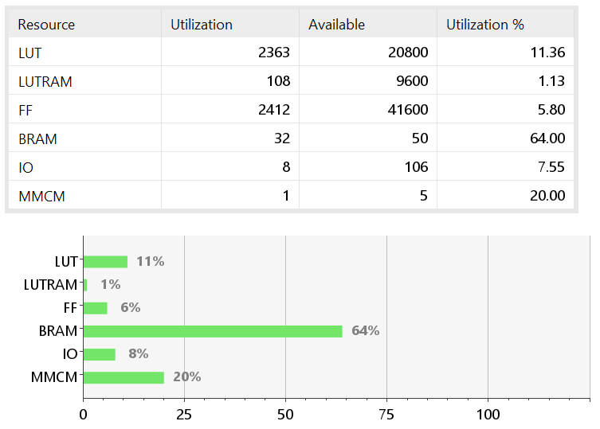

# Implementasi IP I2S TX AXI4-Lite pada FPGA

**Pembicara:** Muhammad Muqtada Alhaddad

**Pembimbing:** Agus Bejo, Wahyu Dewanto

**Tanggal:** (isi tanggal pendadaran)

---

## Garis Besar
- Latar belakang dan motivasi
- Tujuan penelitian
- Metodologi dan arsitektur
- Implementasi & hasil (utilisasi)
- Analisis, kesimpulan & saran

*Catatan pembicara: Jelaskan ringkasan 30–60 detik untuk tiap bagian.*

---

## Latar Belakang
- I2S: standar serial audio populer untuk antarmuka audio
- Kebutuhan: IP I2S TX yang efisien untuk FPGA dengan kontrol AXI4-Lite
- Tantangan: sinkronisasi sampel, throughput, dan utilisasi sumber daya

*Catatan: Singkatkan poin teknis dan tekankan gap riset.*

---

## Tujuan Penelitian
- Merancang dan mengimplementasikan IP I2S TX berbasis AXI4-Lite
- Memverifikasi fungsionalitas dan performa pada FPGA (Basys/Arty)
- Mengukur pemanfaatan sumber daya dan latensi

*Catatan: Tegaskan metrik keberhasilan.*

---

## Metodologi & Arsitektur
- Desain modul: register AXI4-Lite, FIFO/penyangga, serializer I2S
- Alur verifikasi: simulasi + sintesis + implementasi di FPGA
- Alat: Vivado, ModelSim/iverilog, LaTeX untuk dokumentasi

*Catatan: Gunakan diagram blok jika perlu (sisipkan gambar jika tersedia).* 

---

## Implementasi — Register AXI4-Lite
- Pemetaan register kontrol dan status
- Mode: 16/24/32-bit sample support (sebutkan yang diimplementasikan)
- Mekanisme interrupt/ready

*Catatan: Siapkan contoh skenario akses register singkat.*

---

## Implementasi — Serializer I2S
- State machine utama: IDLE → LOAD → SEND_LEFT → SEND_RIGHT → DONE
- Pengelolaan bit clock & word select
- Penanganan underflow/overflow FIFO

*Catatan: Jelaskan alur singkat dan sebutkan bahwa FSM akan ditampilkan jika tersedia.*

---

## Hasil — Utilisasi Sumber Daya
- Ringkasan: LUTs, FFs, BRAM, DSP (tampilkan gambar di bawah)

*Catatan: Jelaskan angka utama (mis. LUT=xxx, FF=xxx). Tunjukkan apakah target terpenuhi.*

---

## Hasil — Fungsional & Pengujian
- Simulasi: gelombang data I2S benar sesuai spesifikasi
- Implementasi: sinyal I2S benar pada hardware, audio uji (opsional)
- Waktu clocking dan batasan throughput

*Catatan: Singkatkan bukti eksperimen; siapkan satu paragraf hasil utama.*

---

## Analisis & Diskusi
- Kelebihan: integrasi AXI4-Lite sederhana, footprint kecil
- Keterbatasan: optimasi timing, pengolahan multichannel belum lengkap
- Perbandingan: ringkas terhadap solusi referensi (jika ada)

*Catatan: Fokus pada pesan kunci yang ingin audiens ingat.*

---

## Kesimpulan
- IP I2S TX berhasil diimplementasikan dan diuji pada FPGA
- Pemanfaatan sumber daya dalam batas yang dapat diterima
- Rekomendasi: pengembangan RX, optimasi timing, dan dukungan multichannel

*Catatan: Akhiri dengan satu kalimat penutup tegas.*

---

## Saran & Pekerjaan Lanjutan
- Eksekusi RX-I2S sebagai kelanjutan
- Perbaikan toleransi jitter dan DMA integration
- Dokumentasi dan rilis IP core untuk publik

*Catatan: Siapkan 2–3 poin tindakan konkret.*

---

## Terima Kasih — Tanya Jawab
- Pertanyaan?

*Catatan: Siapkan jawaban untuk pertanyaan tentang pemilihan desain, metrik, dan rencana lanjutan.*
